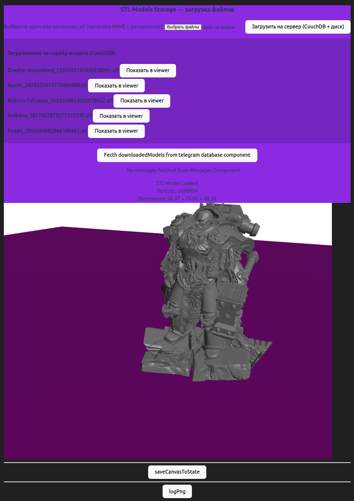

# telegramStlView (FastAPI + Telethon + Vue3)

Проект переписан на новый стек:

- Backend: `Python FastAPI` + `Telethon`
- Frontend: `Vue3` + `Vite` + `TypeScript`
- DB: `CouchDB` (`telegram_messages_2`)

## Архитектура

- `frontend-vue` -> UI для списка Telegram-файлов, Download/Unzip, рендера STL.
- `backend-fastapi` -> API для import/download/unzip/file-download.
- `couchdb` -> хранение документов и статусов обработки.

Ключевые backend маршруты:

- `GET /healthz`
- `GET /telegram/messages`
- `POST /telegram/import`
- `POST /telegram/download` (chunked progress: `Progress: N%`, `Saved to:`, `[ERROR]...`)
- `POST /telegram/unzip` (chunked progress + child STL docs)
- `POST /telegram-downloads/download`

## Запуск

1. Заполните переменные окружения (минимум Telegram API):

```bash
export TELEGRAM_API_ID=...
export TELEGRAM_API_HASH=...
export TELEGRAM_GROUP_ID=...
# опционально
export TELEGRAM_TOPIC_ID=...
```

2. Поднимите сервисы:

```bash
docker-compose up -d --build
```

3. Один раз авторизуйте Telethon-сессию:

```bash
docker-compose exec backend-fastapi python scripts/telethon_login.py
```

4. Импортируйте сообщения из Telegram:

```bash
docker-compose exec backend-fastapi python scripts/import_telegram.py --limit 1000
```

или через API:

```bash
curl -X POST "http://localhost/telegram/import" \
  -H "Content-Type: application/json" \
  -d '{"limit":1000}'
```

5. Откройте frontend:

- `http://localhost:5173`

## Совместимость данных CouchDB

Новый backend поддерживает и обновляет поля:

- `uploaded`
- `savedUrl`
- `file_name`
- `file_type`
- `archive_extracted`
- `processing.download`
- `processing.unzip`
- `parent_doc_id`

Опциональный backfill:

```bash
docker-compose exec backend-fastapi python scripts/backfill_docs.py
```


